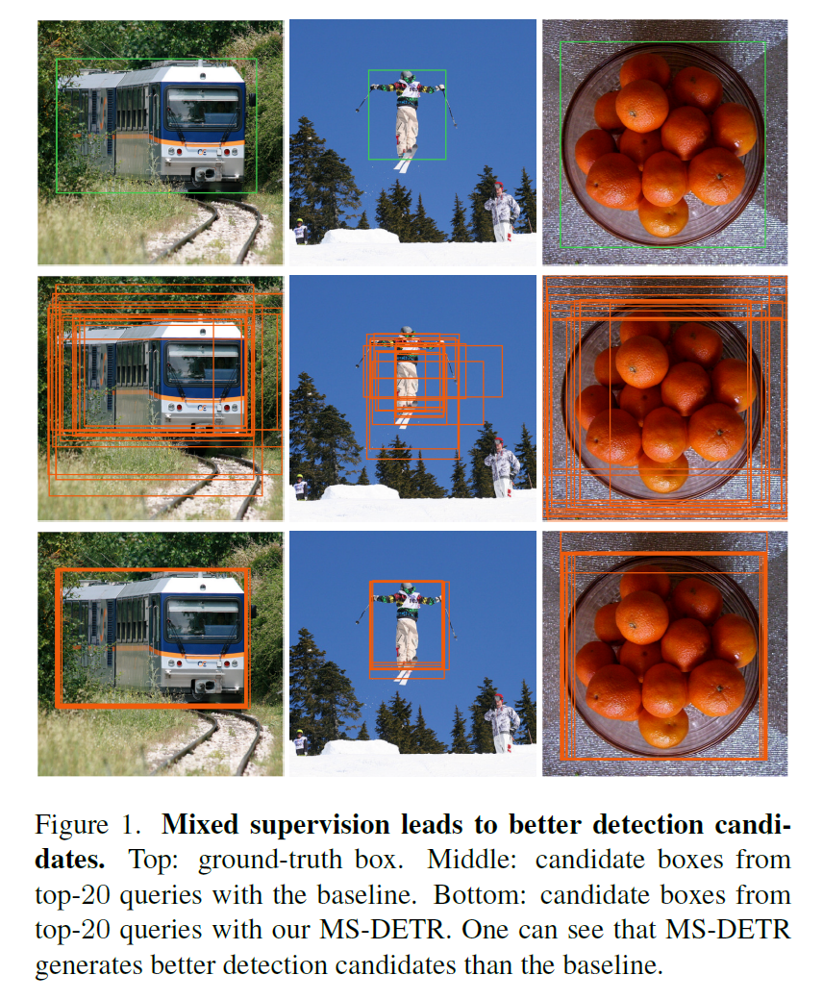
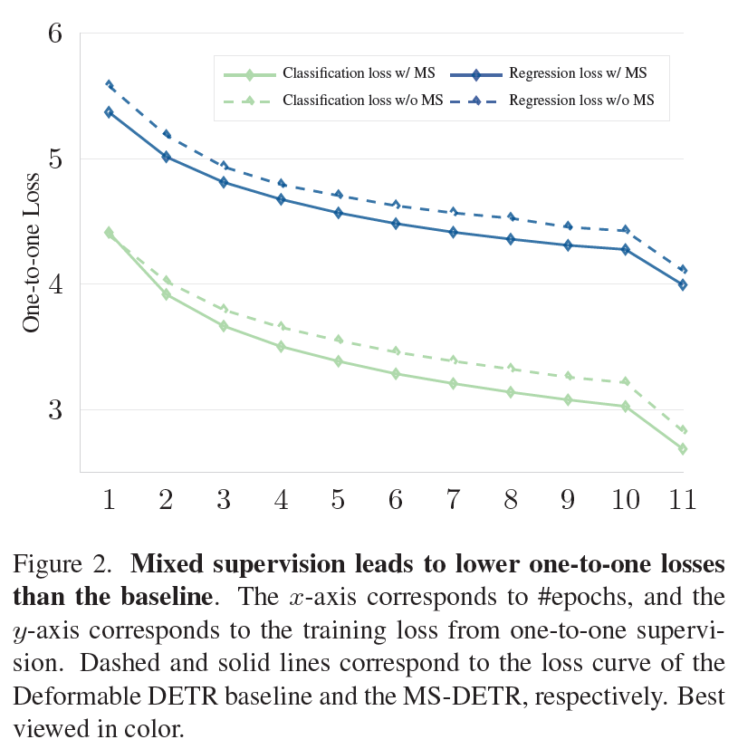
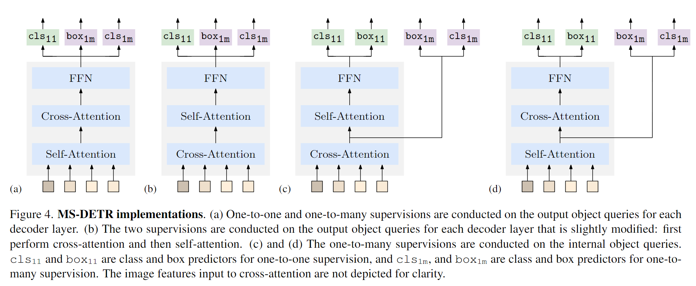

# MS-DETR

This repository is an official implementation of "[MS-DETR: Efficient DETR Training with Mixed Supervision](https://arxiv.com)"

Authors: Chuyang Zhao, Yifan Sun, Wenhao Wang, Qiang Chen, Errui Ding, Yi Yang, Jingdong Wang

## Introduction

DETR accomplishes end-to-end object detection through iteratively generating multiple object candidates based on image features and promoting one candidate for each ground-truth object. The traditional training procedure using one-to-one supervision in the original DETR lacks direct supervision for the object detection candidates.

<div align=center>


</div>

We aim at improving the DETR training efficiency by explicitly supervising the candidate generation procedure through mixing one-to-one supervision and one-to-many supervision. Our approach, namely MS-DETR, is simple, and places one-to-many supervision to the object queries of the primary decoder that is used for inference. In comparison to existing DETR variants with one-to-many supervision, such as Group DETR and Hybrid DETR, our approach does not need additional decoder branches or object queries. The object queries of the primary decoder in our approach directly benefit from one-to-many supervision and thus are superior in object candidate prediction. Experimental results show that our approach outperforms related DETR variants, such as DN-DETR, Hybrid DETR, and Group DETR, and the combination with related DETR variants further improves the performance.

<div align=center>  

</div>


**Note**: The code for MS-DETR will be released upon acceptance of the associated paper.

## Citation

If you use MS-DETR in your research or wish to refer to the baseline results published here, please use the following BibTeX entry.

```BibTeX
@inproceedings{chen2023group,
      title={Group DETR: Fast DETR Training with Group-Wise One-to-Many Assignment},
      author={Chen, Qiang and Chen, Xiaokang and Wang, Jian and Zhang, Shan and Yao, Kun and Feng, Haocheng and Han, Junyu and Ding, Errui and Zeng, Gang and Wang, Jingdong},
      booktitle={Proceedings of the IEEE International Conference on Computer Vision (ICCV)},
      year={2023}
    }
```
